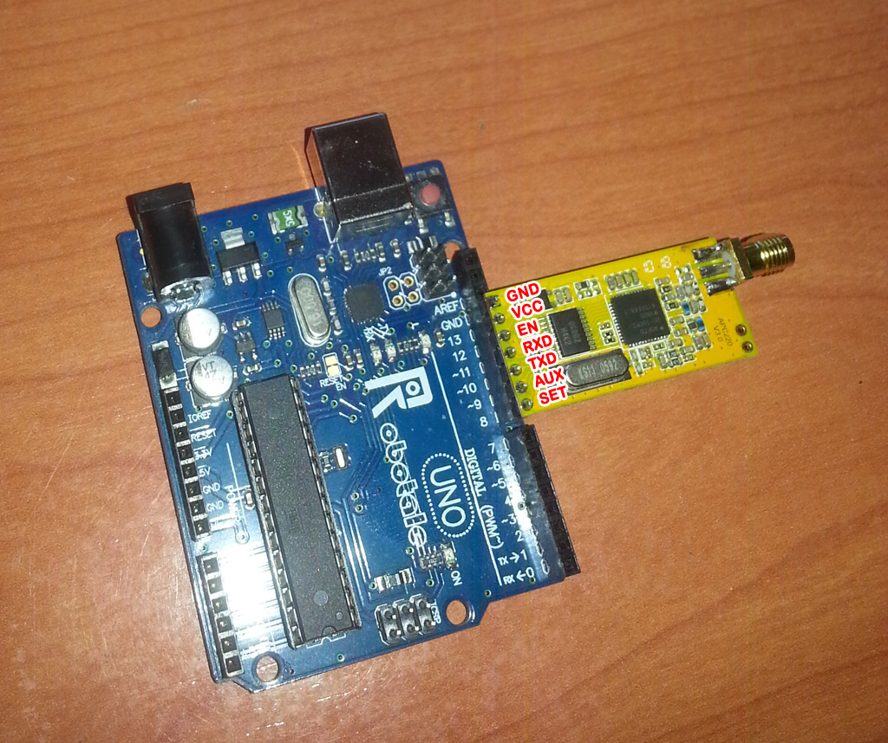

# APC220_Transceiver
***Utilidad para configurar el APC220 desde Arduino / linux***

Recordad que hasta una proxima version en la que trataré de hacer 
que la grabacion y lectura de configuracion en el modulo sea 
algo mas interactiva, por ahora debemos modificar el programa 
de arduino para despues conectar el modulo y que se cargen los valores

Cuando se lee la configuracion del modulo se obtiene un linea similar a esta

####   PARAM  AAAAAA B C D E
####   PARAM  415370 2 9 3 0 
	AAAAAA, es la frecuencia de trabajo del modulo expresada en KHz 
	Puede oscilar entre 418MHz y 455MHz
	***en el ejemplo 415.37***

	B, es la velocidad de transmision de radio frecuencia puede tomar los siguientes valores
	1 (2400bps), 2 (4800bps), 3 (9600bps), 4 (19200bps)
	***en el ejemplo 4800bps***
	
	C, es la potencia de emision, puede tomar valores entre 0 y 9, siendo 9 la mayor potencia
	en el ejemplo 9
	
	D, velodidad de transferencia entre el modulo y arduino o PC 	, toma valores entre 0 y 6
	0 (1200bps), 1 (2400bps), 2 (4800bps),3 (9600bps), 4 (19200bps), 5 (38400bps), 6 (57600bps)
	*en el ejemplo 9600bps*
	
	E, es el control de paridad de la informacion emitida por RF
	0 (sin control de paridad), 1 (paridad par), 2 (paridad impar)
	*en el ejemplo sin control de paridad*
	
	para mas detalles consultar el datasheet que hay en este repositorio o directamente en la pagina del fabricante
	https://wiki.dfrobot.com/APC220_Radio_Data_Module_SKU_TEL0005_

Para grabar informacion se ha de enviar una linea similar, modificando el sketch de configuracion
#### WR 434000 3 9 3 0
Esta configuracion seria: Frecuencia de emision 434MHz, velocidad RF 9600bps, 
maxima potencia, Puerto serie 9600bps y sin control de paridad.

Consejos, que no obligaciones.
1. Grabar el programa en arduino sin tener el modulo conectado.
2. Desconectar Arduino del USB de programacion y/o de cualquier otra fuente de alimentacion
3. Conectar el modulo como se indica en la fotografia (es la manera mas comoda)
   o bien mediante cables dupont.
4. Volver a conectar Arduino al ordenador apra que se produzca la grabacion de la configuracion o para leer la que contiene   
   
#### Guia de conexion del APC220 directamente sobre Arduino

en la fotografia y marcados en rojo esta la distribucion fisica de pines del APC220
Haremos coincidir el pin GND del modulo con el propio de la tarjeta Arduino UNO
y el resto coindiriran con pines digitales tal como se indica.

	   ARDUINO     	   APC220
		GND         	GND
		13		--->	VCC
		12		--->	EN
		11		--->	RXD
		10		--->	TXD
		 9		--->	AUX
		 8		--->	SET

Notad que al definir las funciones de los pines en el esketch de arduino al pin 11 ---> se le asigna la funcion TXD
y al pin 10 ---> la funcion RXD, dado que dichos pines han de estar intercambiados entre el puerto serie de Arduino y el del módulo

Segun el datasheet del fabricante el modulo consume como maximo unos 35mA (y eso seria emitiendo)
Puesto que vamos a trabajar con el sin emitir nada, solo configurandolo, 
podemos asumir sin temor a equivocarnos que un pin de arduino que puede entregar hasta 40mA
será suficiente para limentarlo.
Aprovechamos esto para poder conectar el modulo directamente en los pines de arduino sin necesidad
de cableado y programar un pin digital (en nuestro caso D13) como salida Activa que hara las veces de Vcc para el modulo
